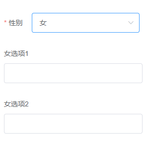
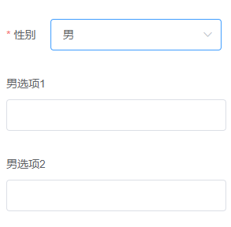

[TOC]

# 高级动态表单

> 一个多级联多分组且支持elementUI中所有表单的动态表单插件

## 安装

```shell
npm i dynamic-form-advanced
```

## 使用指引

1. 在 `main.js` 中引入。
```javascript
import Vue from 'vue'
import App from './App.vue'
import DForm from 'dynamic-form-advanced'
import elementUI from 'element-ui'
import 'element-ui/lib/theme-chalk/index.css';

Vue.use(elementUI)
Vue.use(DForm)
Vue.config.productionTip = false

new Vue({
  render: h => h(App),
}).$mount('#app')
```

2. 示例

```html
<template>
  <el-form ref="form" :model="formData">
    <DForm :structure="structureData" v-model="formData"/>
  </el-form>
</template>

<script>
export default {
  data() {
    return {
      formData: {},
      structureData: {
        groups: [
          {index: 1,name: "" }, {index: 2,name: ""}
        ],
        formItemDefine: {
          gender: {
            label: "性别",
            formType: "select",
            field: "gender",
            attributes: {
              elFormItem: {
                required: true
              }
            },
            options: [
              {label: "男",value: "male" },
              {label: "女",value: "female" }
            ]
          },
          maleOption1: {
            label: "男选项1",
            formType: "input",
            field: "option.male.0"
          },
          maleOption2: {
            label: "男选项2",
            formType: "input",
            field: "option.male.1"
          },
          femaleOption1: {
            label: "女选项1",
            formType: "input",
            field: "option.female.0"
          },
          femaleOption2: {
            label: "女选项2",
            formType: "input",
            field: "option.female.1"
          }
        },
        structureDefine: {
          gender: {
            group: 1,
            children: {
              male: {
                maleOption1: { group: 1, children: null },
                maleOption2: {  group: 1, children: null }
              },
              female: {
                femaleOption1: { group: 2, children: null },
                femaleOption2: { group: 2, children: null }
              }
            }
          }
        }
      }
    }
  }
}
</script>
```

3. 运行结果

性别选择“女”时：


性别选择“男”时：


## 参数配置

`structure` 属性接收一个对象，对象包含 `groups` ， `formItemDefine` 和 `structureDefine` 。

### groups属性

`groups` 是一个数组，它定义了当前这个表单一共有多少组，比如示例中定义了两个组。

```javascript
groups: [
  {index: 1,name: ""},
  {index: 2,name: ""}
]
```

`groups` 的每一项包含 `index` 和 `name` 属性。其中 `name` 属性是显示在页面上的， `index` 属性我们会在后面结合 `structureDefine` 属性展示具体作用。

### formItemDefine属性

所有的表单项都在 formItemDefine 中定义。里面的每一项的key表示这一项的名称，value表示这一项的具体定义。
例如，如下是一个名叫 `gender` 的select选择器表单项的定义。
```JavaScript
formItemDefine: {
  gender: {
    label: "性别",
    formType: "select",
    field: "gender",
    attributes: {
      elFormItem: {
        required: true
      }
    },
    options: [
      {label: "男",value: "male" },
      {label: "女",value: "female" }
    ]
  }
}
```

#### 表单项的属性
|属性名       |类型         |是否必须   |描述                 |
|--           |--           |--         |--                   |
|label        |String       |是         |显示名称|
|formType     |String       |是         |表单类型，见下方 `formType` 详情|
|field        |String       |是         |字段名，可以使用 `"."` 来创建结构；例如 `"aaa.bb"` 表示将用户输入的值放在 `aaa.bb` 下，最后生成的结构是 `{ aaa: { bb: "input value" } }` 。|
|default      |String | Number|否         |字段默认值                   |
|options      |Array        |否         |选项，每一项都是 `{ label: "显示", value: "背后的值" }` ，在某些 `formType` 下使用，见下方 `formType` 详情。|
|attributes   |Object       |否         |组件的属性，见下方 `attributes` 详情|

#### formType属性

|取值       |是否需要options属性   |描述                 |
|--         |--                    |--                  |
|radio      |需要                 |单选框|
|select     |需要                 |选择器|
|input      |不需要               |输入框|
|checkbox   |需要                 |多选框|
|input-number|不需要              |计数器|
|switch     |不需要               |开关|
|slider     |不需要               |滑块|
|time-select|不需要               |时间选择器|
|date-picker|不需要               |日期选择器|
|rate       |不需要               |评分|
|color-picker|不需要              |颜色选择器|

### attributes属性

想为组件设置属性的话可以在 `attributes` 中设置。

例如，如下示例为`<el-form-item>`组件设置了 `required` 、 `label-width` 和 `size` 属性，为 `<el-select>` 组件设置了 `placeholder` 属性。

```JavaScript
formItemDefine: {
  gender: {
    label: "性别",
    formType: "select",
    field: "gender",
    attributes: {
      elFormItem: {
        required: true,
        "label-width": "100px",
        size: "mini"
      },
      elSelect: {
        placeholder: "请选择"
      }
    },
    options: [
      {label: "男",value: "male" },
      {label: "女",value: "female" }
    ]
  }
}
```

> Tips: 每个表单项都会有 `<el-form-item>` 组件，所以在 `attributes` 下都可以设置 `elFormItem` 的属性。其他的组件就不同了，是根据你在 `formType` 设置的值来的；如果你设置的是 `select` ，那么就是在 `attributes` 下设置 `elSelect` 的属性，如果是 `input` ，那么所对应的就是 `elInput` 。

### structureDefine属性

这里定义了表单的级联和分组结构。

例如如下示例结构，使用了一个名叫 `gender` 的表单项，当这个表单项的值为 `male` 时渲染名为 `maleOption1` 和 `maleOption2` 表单项；当值为 `female` 时，渲染 `femaleOption1` 和 `femaleOption2`。

```javascript
structureDefine: {
  gender: {
    group: 1,
    children: {
      male: {
        maleOption1: { group: 1, children: null },
        maleOption2: {  group: 1, children: null }
      },
      female: {
        femaleOption1: { group: 2, children: null },
        femaleOption2: { group: 2, children: null }
      }
    }
  }
}
```

`group` 属性定义了当前表单项渲染在哪个分组。它的值与上文 *[groups属性](#groups属性)* 中提到的 `index` 相关联。在上面这个示例中， `gender` 表单项的 `group` 为 `1` ，表示渲染在第一个分组里； `femaleOption1` 和 `femaleOption2` 的 `group` 为 `2` ，表示渲染在第二个分组里。

## License
[MIT](./LICENSE)